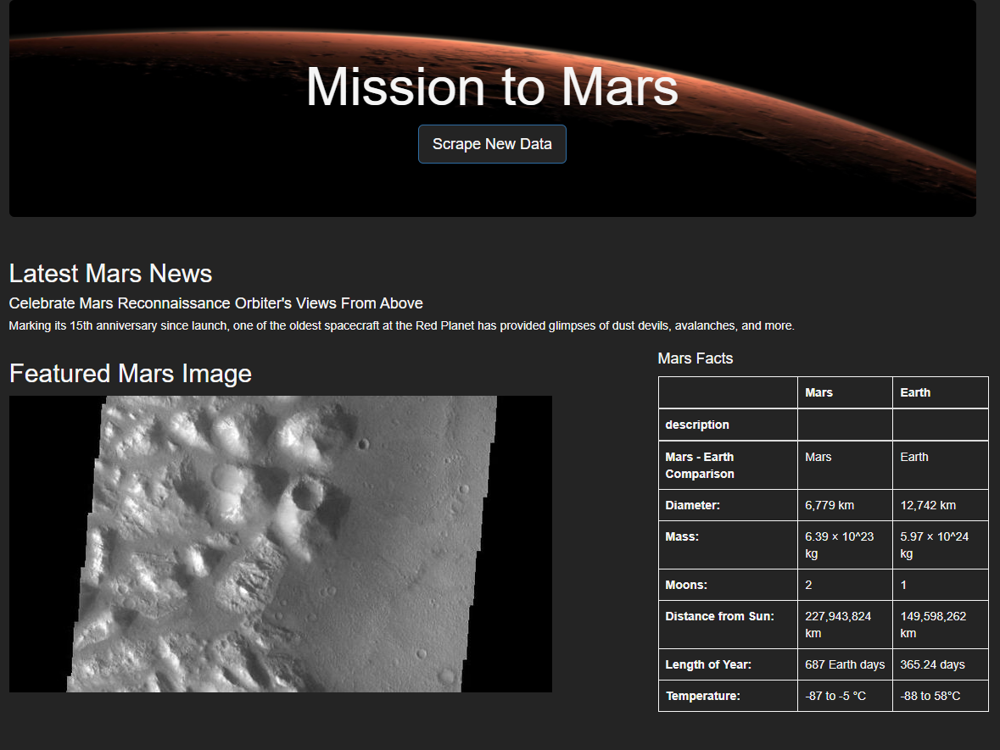
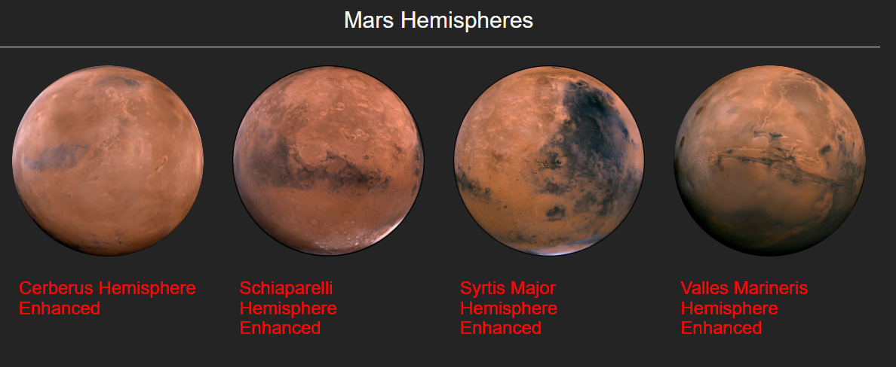

# Mission_to_Mars  

## Overview of Project  

**Purpose:**  
The purpose of this project is to create a webpage that will scrape current news article, facts, and images of Mars with a click of a button.  

## Resources:  
- Data Source: [NASA news](http://redplanetscience.com), [Featured Image](http://redplanetscience.com), [Galaxyfacts](https://galaxyfacts-mars.com), [Mars Hemispheres](https://marshemispheres.com/)  
- Software: Python 3.9.7, Jupyter Notebook 6.4.5, Flask 1.1.2, VS code 1.63.2 Mongodb 5.0.6  

## Analysis and Results  

**Step-by-Step:**  
For this project, we used Jupyter Notebook and VS code to create and test our functions for scraping data from different websites. Within our code, we imported splinter and beautifulsoup to assist with scraping and parsing the html code from websites where we wanted to gather our information and images. After we have scraped data, we stored the data into mongodb, a database. That way we can access the data after someone clicks our scrape button on our webpage. Next, we created a webpage with html code to view and display the data that we scraped, while adding additional visualizations along the way to make our webpage look visually appealing.

**Results:**  
  
  

## Challenge Summary  

**Summary**  
The purpose of this project is to create a webpage that will scrape data and images from specific websites to collect, store, and display all of the information on a single webpage with a click of a button.  
 
### Codes Used  
(Please look at specific files for codes used)  
Code for [scraping data and images](https://github.com/tonywang3571/Mission_to_Mars/blob/master/scraping.py)  
Code for [storing data and rendering webpage](https://github.com/tonywang3571/Mission_to_Mars/blob/master/app.py)  
Code for [building webpage](https://github.com/tonywang3571/Mission_to_Mars/blob/master/templates/index.html)  
